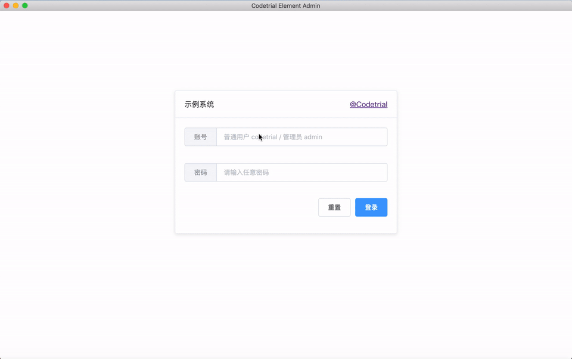

# Element Admin

[](https://github.com/codetrial/element-admin)

一个简约而不简单的基于 Vue CLI 3 和 ElementUI 的中后台管理系统。

此项目由一个不可思议的 vue cli 插件构建 - [@codetrial/vue-cli-plugin-element](https://github.com/codetrial/vue-cli-plugin-element)

:cn: 简体中文 | [:us: English](README.md)

## 文档

[:zap: 在线示例](https://element-admin.now.sh) | [:book: 参考文档](https://codetrial.github.io/element-admin)

## 截屏预览



## 快速开始

### 使用 Git

```bash
# 克隆这个仓库
yarn install
yarn run serve
```

### 使用 Vue CLI

```bash
vue create --preset codetrial/vue-cli-plugin-element your-project
```

## 核心功能

:camera: **最小依赖**：仅依赖 Vue 官方库及 ElementUI 组件库，未额外引入其它第三方库，为你提供自由发挥的空间。

:tv: **目录结构**：根据项目实战经验，设计了合理、清晰的目录结构。

:telephone_receiver: **页面布局**：使用 Vue Router 嵌套路由及 ElementUI 内置组件进行布局。

:pager: **数据处理**：添加独立的 api 及 service 层，将业务逻辑从组件中抽离。

:watch: **权限控制**：为路由添加配置式拦截器，默认支持用户登录鉴权及角色鉴权。

:radio: **列表示例**：一个相对比较完整的列表页示例，包含字段查询（过滤），字段排序，页码跳转，批量操作等等。

:mag_right: **表单示例**：一个相对比较完整的表单页示例，包含表单校验、提交等操作。

:ghost: **错误页面**：内置简单的（其实是偷懒） 403、404 及 500 错误页。

## 贡献

期待你的 `pull requests`。如果你觉得有帮助，还请多多反馈！

## 技术栈

- [Vue.js](https://github.com/vuejs/vue)
- [ElementUI](https://github.com/ElemeFE/element)

## 许可

[MIT](http://opensource.org/licenses/MIT)

Copyright (c) 2018 - present, Felix Yang
